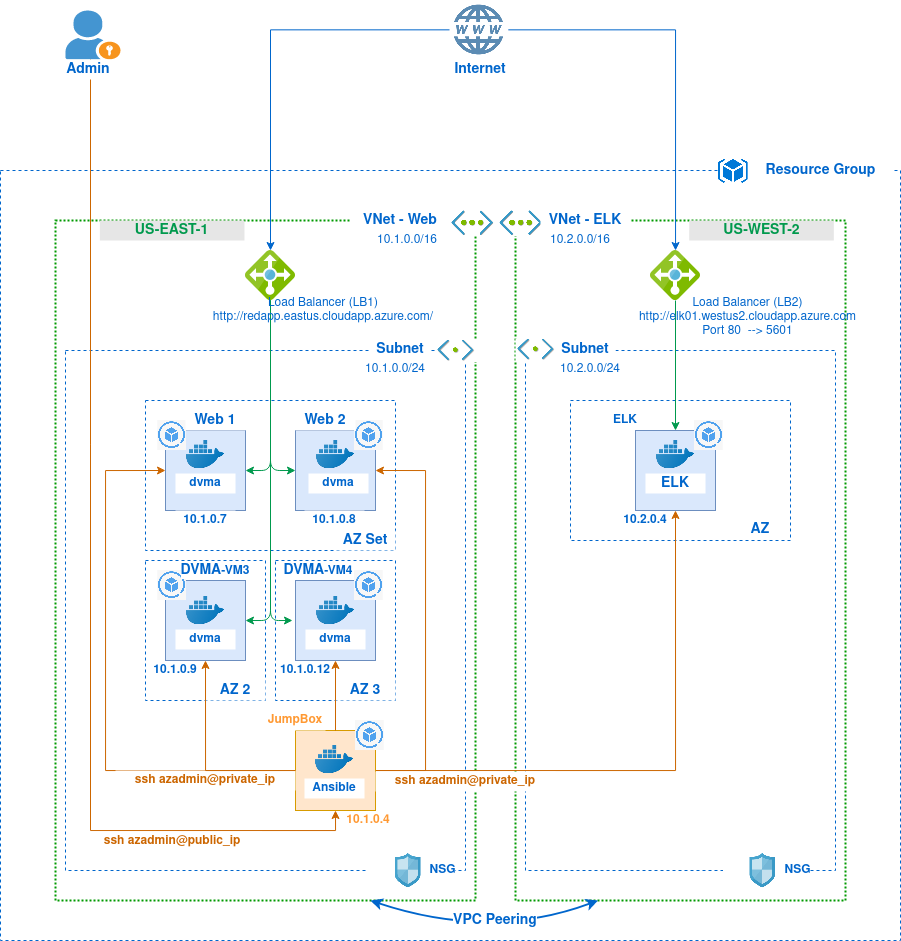
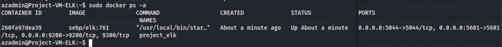

## Automated ELK Stack Deployment

The files in this repository were used to configure the network depicted below.



These files have been tested and used to generate a live ELK deployment on Azure. They can be used to either recreate the entire deployment pictured above. Alternatively, select files may be used to install only certain pieces of it, such as Filebeat.

  - [Docker Setup (project_playbook.yml)](Ansible/project_playbook.yml)
  - [Filebeat Setup (filebeat-playbook.yml)](Ansible/filebeat-playbook.yml)
  - [Metribeat Setup (metribeat-playbook.yml)](Ansible/metricbeat-playbook.yml)

This document contains the following details:
- Description of the Network Topology
- Access Policies
- ELK Configuration
  - Beats in Use
  - Machines Being Monitored
- How to Use the Ansible Build


### Description of the Topology

The main purpose of this network is to expose a load-balanced and monitored instance of DVWA, the D*mn Vulnerable Web Application.

#### Loadbalancer: 
Load balancing ensures that the application will be highly available, in addition to restricting public access to the network. A load balancer, with the help of heatlh checks, directs traffic only to healthy instances. A load balancer associated with a scaling policy when placed in front of multiple instances  of the application can also help in mitigating a DDoS attack.  
#### JumpBox:
The main purpose of a jumpbox is to seperate the private network resources access from the public access. It usually has high security measures implemented because in order to access the VMs within the private network a user would log into the jumpbox with the public IP and through the jumpbox, access the private VMs. 

#### ELK Server:
ELK is set of open source tools (Elasticsearch, Logstash, Kibana) to collect, transform and visualize data. ELK servers make use of beats which are lightweitght agents installed to collect and send data to the ELK stack. Integrating an ELK server allows users to easily monitor the vulnerable VMs for changes to the data collected from different sources such as through the Filebeat and system metrics through the Metricbeat.
- Filebeat: It is used as a logging agent to collect logs file and ship it to the ELK server
- Metricbeat: This is use to collect various system and service metrics. 

#### Network Configurations:
The configuration details of each machine may be found below.


| Name     | Function | IP Address | Operating System |
|----------|----------|------------|------------------|
| JumpBox | Gateway  | 10.1.0.4   | Ubuntu 18.0.4 LTS|
| Web 1     | Web Server| 10.1.0.7 |Ubuntu 18.0.4 LTS |
| Web 2     | Web Server| 10.1.0.8 |Ubuntu 18.0.4 LTS |
| DVMA-VM3    | Web Server | 10.1.0.9| Ubuntu 18.0.4 LTS |
| DVMA-VM4    | Web Server| 10.1.0.12 |Ubuntu 18.0.4 LTS|
| ELK    | ELK Stack | 10.2.0.4 |Ubuntu 18.0.4 LTS |


### Access Policies

The machines on the internal network are not exposed to the public Internet. Only the JumpBox machine can accept connections from the Internet. Access to the JumpBox machine is only allowed from the admins local machine. The web application and Kibana dashboard is accessed through the load balancers public IP DNS name. 

Machines within the network can only be accessed by the JumpBox machine. The admin is able to access the ELK machine with the private IP 10.2.0.4 by first logging into the JumpBox with the JumpBox's public IP and then through the JumpBox connect to the ELK server. 

A summary of the access policies in place can be found in the table below.

| Name     | Publicly Accessible | Allowed IP Addresses |
|----------|---------------------|----------------------|
| Jump Box | Yes              | Admin's Local Machine IP, VNet Peered N/W|
| Web 1    | No               |JumpBox IP (10.1.0.4) via SSH |
| Web 2    | No          |JumpBox IP (10.1.0.4) via SSH |
| DVMA-VM3 | No          |JumpBox IP (10.1.0.4) via SSH |
| DVMA-VM4 | No          |JumpBox IP (10.1.0.4) via SSH |
| ELK    | No         |JumpBox IP (10.1.0.4) via SSH |
| LB1     | Yes     | public IP and DNS name |
| LB2     | Yes     | public IP and DNS name |

### Elk Configuration

Ansible was used to automate configuration of the ELK machine. No configuration was performed manually, which is advantageous because using ansible's playbooks which are written in plain english in the YAML format, it is possbile to automate repetative and conplex task like docker installations, system updates and ELK stack installations. Ansible does not need an agent installed on the child nodes and connections are made thorugh ssh or can be scripted through python. 

The playbook implements the following tasks:
  * Docker Installation
  * Python and Docker python library 
  * Enabling the docker service at start 
  * Downloading and running the elk docker container. 
 

The following screenshot displays the result of running `docker ps` after successfully configuring the ELK instance.




### Target Machines & Beats
This ELK server is configured to monitor the following machines:
- Web 1 at IP 10.1.0.7
- Web 2 at IP 10.1.0.8

The following Beats have been installed on these machines:
  * Filebeat
  * Metricbeat

These Beats allow us to collect the following information from each machine:
  * Filebeat: This is a logging agent which is used to collect log files and send the data to the ELK server. When specified a path like ` var/log/*.lgo* ` in the filebeat config file, filebeat collects logs files generated within that folder path and sends the logs to the elk server for processing. Unlike Logstash, filebeat is used for basic processing and not for advanced usage. 
  * Metricbeat: The metricbeat docker module helps to collect metrics related to docker containers such as CPU usage, DiskIO, memory and number of containers runnings.  


### Using the Playbook
In order to use the playbook, you will need to have an Ansible control node already configured. Assuming you have such a control node provisioned as a ansible docker container following given steps to run the ansible playbooks: 

 1. ssh to the jump box, start the ansible docker container (if not running already) and enter into the ansible container
 2. Navigate to the `/etc/ansible` folder

 3. Update the `hosts` file within that folder to include the webservers internal IPS
```
[webservers]
10.1.0.7 ansible_python_interpreter=/usr/bin/python3
10.1.0.8 ansible_python_interpreter=/usr/bin/python3

[elk_servers]
10.2.0.4 ansible_python_interpreter=/usr/bin/python3
```
4. Update the `ansible.cfg` file with the remote username
```
remote_user = azadmin
```
5. Copy the [project_playbook.yml](Ansible/project_playbook.yml) file in the `/etc/ansible` folder

6. Use the following command to run the ELK setup. 
```
ansible-playbook project_playbook.yml
```
7. After the installation have been completed, navigate to the `http://<<load_balancer_public_ip>>/app/kibana` to verify the installation. The following dashboard should be displayed. 

[kibana-dashboard](Diagrams/kibana-dashboard.png)

8. Copy the [filebeat playbook]() and the [metricbeat playbook]() in the `/etc/ansible` folder and use the following commands to run the playbooks. 
Filebeat playbook
```
ansible-playbook install-filebeat-playbook.yml
```
Metricbeat playbook
```
ansible-playbook install-metricbeat-playbook.yml
```
 